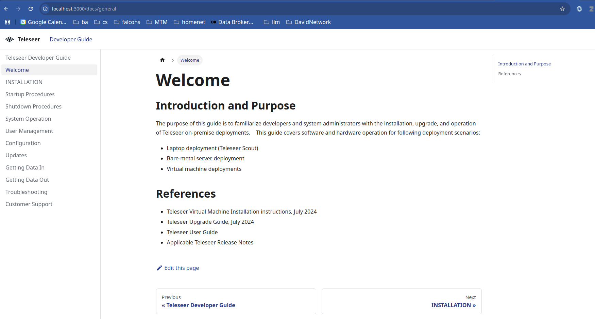

# Teleseer Splunk Elasticsearch Interoperability Report

This project contains markdown that is use to render the Teleseer Splunk Elastic Interoperability Report.  It also contains logic to render a website version of the doc (using Docusaurus) or a pdf (using pandoc+latex)

## Edits

 * The content is contained in the [docs](./docs/) folder.
 * You can edit directly in Github, in VS Code, or Obsidian (see Obsidian Tips below)
 * Images should all be placed in [docs/images](./docs/images/).  You can configure [Obsidian](https://help.obsidian.md/Editing+and+formatting/Attachments) and VS Code to paste new images there.
 * Headings:  All H1 Headers (e.g. `# H1 Headers`) will appear as major sections in the PDF
   * A good design is to create a single H1 header for each `.md` file
   * Then use ordering (see next bullet) to put things in order
 * Order:
   * PDF ordering is controlled by the alphanumeric sort order of the `*.md` files in `docs`
   * Webpage order is controlled via this property in each md file:

    ```
    ---
    sidebar_position: 1
    ---
    ```

## Website Rendering

Web rendering is handled using a local Docusaurus instance.  If you want to build and view the documentation follow these steps:

```
npm i
npm run build
npm run serve
```

This will build and render a docusaurus documentation site on localhost:  `http://localhost:3000/`



## Image and Hyperlink Syntax

Ensure you are not using the `[[WikiLinks]]` syntax (Obsidian default).  Under settings, files & links:


## PDF Rendering

### Install pre-req's:

  * pandoc (3.2-1)
  * latex

    ```
    ii  preview-latex-style                            12.2-1ubuntu1                           all          extraction of elements from LaTeX documents as graphics
    ii  texlive-latex-base                             2021.20220204-1                         all          TeX Live: LaTeX fundamental packages
    ii  texlive-latex-extra                            2021.20220204-1                         all          TeX Live: LaTeX additional packages
    ii  texlive-latex-recommended                      2021.20220204-1                         all          TeX Live: LaTeX recommended packages
    ```

### Render

```
cd teleseer-interoperability
./compile_pdf.sh
```

You should see output:

```
====================================================================================
Rendering Teleseer Developer Guide as a PDF.  This may take a few minutes...
====================================================================================
```

After 2-3 minutes the pdf will be inside the `./build` folder


## Obsidian Tips

### Ensure your outline is enabled


### Ensure you configure pasted media

See [Pasting Attachments into Obsidian](https://help.obsidian.md/Editing+and+formatting/Attachments)# bh-teleseer-interoperability-report
