# System Overview

## System Context Diagram

The following diagram depicts the interoperability system context:

### Components

1. **Teleseer**
    
    - Teleseer acts as the central network telemetry analysis and mapping platform.
    - It interacts with external data sources like Splunk and Elasticsearch to both ingest data for visualization and export processed telemetry data (Teleflow).
    - Supports bi-directional integration:
        - **Inbound**: Queries to overlay external data onto Teleseer’s timeline and assets.
        - **Outbound**: Exports enhanced telemetry data (Teleflow) for use in external tools.
          
2. **Splunk**
    
    - **any index**: Represents general Splunk indices used for querying and overlaying event data in Teleseer projects (described [below]()).  
    - **teleflow Index**: A dedicated index in Splunk to store Teleseer enhanced netflow  (Teleflow) exported from Teleseer.
    
      
3. **Elasticsearch**
    
    - **any index**: Represents general Elasticsearch indices used for querying and overlaying event data in Teleseer projects (described below).
    - **teleflow index**: A dedicated index in Elasticsearch to store Teleseer enhanced netflow (Teleflow) exported from Teleseer.
    

### Flows

          
1. **Splunk to Teleseer (Inbound Query)**
    
    - **Export API + FDW (overlay query)**
        - Teleseer queries any Splunk’s index using the Export API and a Foreign Data Wrapper (FDW) to retrieve relevant event data.
        - This data is overlaid onto Teleseer’s timeline and attached to network topology as asset tags.  This provides context about which assets where involved with Splunk events.
          
2. **Elasticsearch to Teleseer (Inbound Query)**
    
    - **search API (overlay query)**
        - Teleseer queries Elasticsearch’s **any index** using the Elasticsearch search API to retrieve relevant events.
        - Events from Elasticsearch are overlaid onto Teleseer’s timeline and correlated with network telemetry for deeper insights.
        - This data is also overlaid on network topology as asset tags.  This provides context about which assets where involved with Elasticsearch events.
        

3. **Teleseer to Splunk (Outbound Teleflow)**
    
    - **HEC API (teleflow)**
        - Teleseer exports enhanced telemetry data (Teleflow) to the **teleflow Index** in Splunk using the Splunk HTTP Event Collector (HEC) API.
        - Teleflow data includes enriched network telemetry which includes packet flows, MAC addresses, IP addresses, ports, event durations, protocols, and hostnames.
          
4. **Teleseer to Elasticsearch (Outbound Teleflow)**
    
    - **doc API (teleflow)**
        - Teleseer exports Teleflow data to the **teleflow index** in Elasticsearch using Elasticsearch’s Document API (doc API).
        - The Teleflow data is mapped to the Elastic Common Schema (ECS) for easy retrieval and visualization in Kibana dashboards.

## Overlay Queries

### Splunk Overlay Query

Teleseer provides an ability to query Splunk via an inbound Splunk Connector.   This allows a user in Teleseer to overlay events from a Splunk search onto the timeline and assets in a Teleseer Project.  This provides an ability to correlate events and data between the two platforms.

#### Splunk Query Operation

A Splunk search icon is available in the project window.  After pressing the icon, a text box appears.  The user can enter a Splunk query in this box (or leave it blank for the default index):

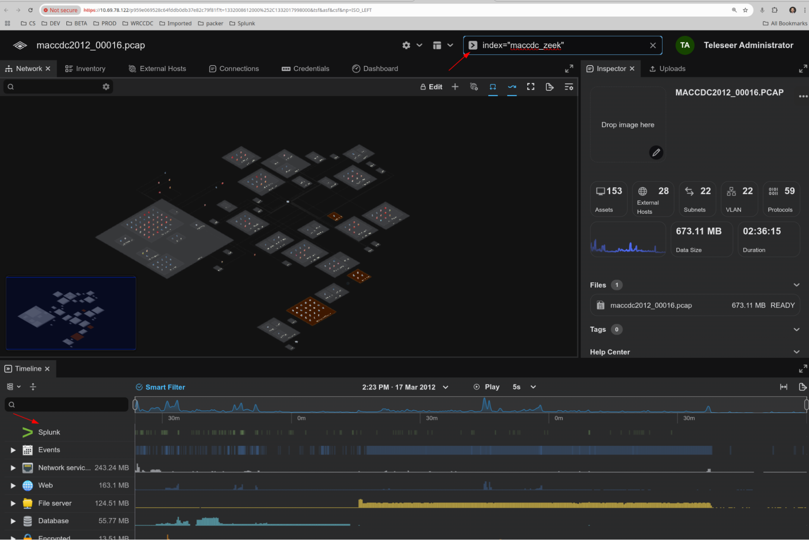

> **Note**:  The Splunk query must begin with the syntax `index=<an_index>` followed by the rest of an (option) query specified in Splunk SPL.

When the Splunk connector is properly configured (see next section), and the results of the query overlap the timeframe encompassing the Teleseer Project, a Splunk lane will appear at the top of the timeline visualizing when the Splunk events occurred in time. Selecting or hovering over these events will reveal the underlying Splunk event details.  

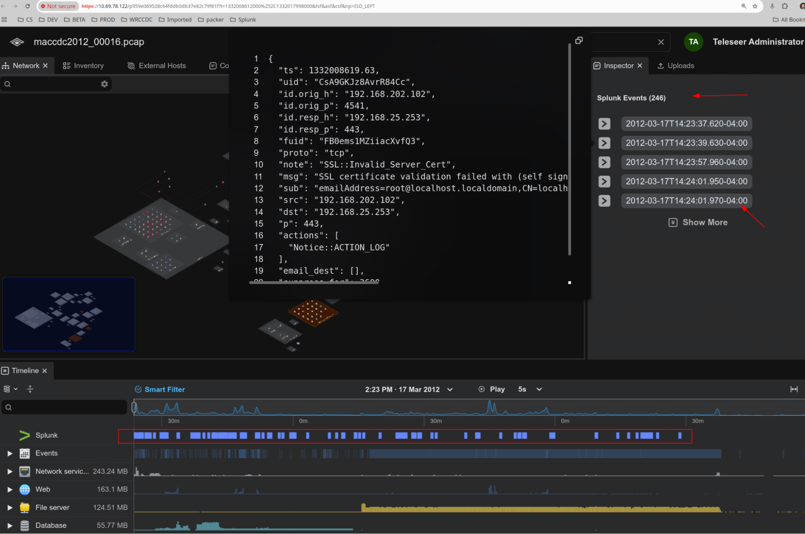

The Teleseer Splunk lane will contain events that correspond to the result set of the same search executed in Splunk.  If these are selected, the raw Splunk records are inluded in the Teleseer Inspector window.  For example, the image above is whoein Splunk results corresponding to this query executed in Splunk:

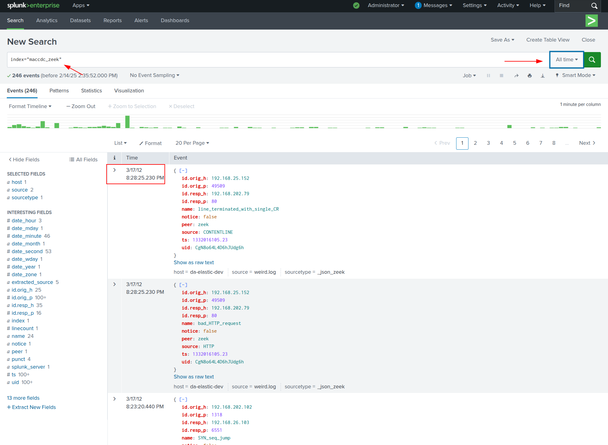

Teleseer will also match any host in its inventory that shares a MAC address or IP address with any event returned from Splunk.  These Teleseer hosts that have IP addresses or MAC addresses anywhere in a Splunk event record will be specially designated with a Splunk tag.

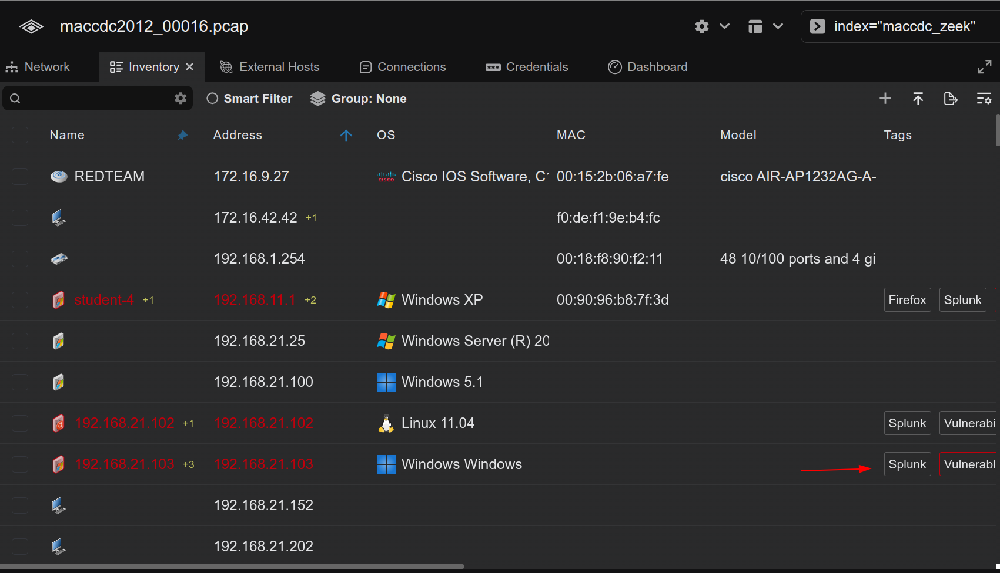

These are searchable, allowing a user to quickly filter for hosts that appear in the Splunk query:

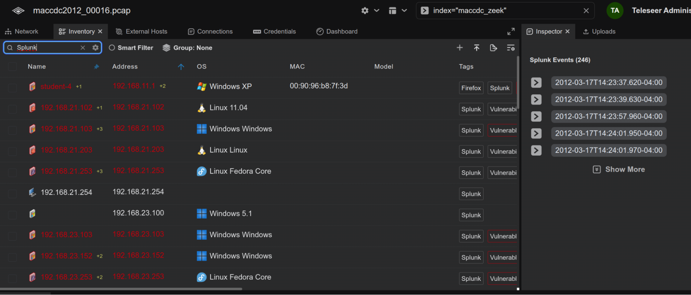

> **Note**: Matching Splunk records to Teleseer hosts by IP and MAC Address is speculative, and may result in false positives matches (or false negatives).  IPs and MAC addresses can dynamically change.  It’s also possible to have two hosts with the same IP address on different subnets – both in a single Teleseer project.  Teleseer uses a robust technique for identifying hosts and should be considered ground truth for all host identification.

It is important to reiterate that if the Splunk query does not yield events that overlap in the same time bounds as the project, they will not be displayed.   The time bounds of the Teleseer project are defined as the earliest and latest times that appear in the PCAPs and other telemetry uploaded into the project.  This is depicted in the timeline.  Teleseer does not use any of the Splunk event times to set its own time bounds – they are strictly an additive layer.

### Elasticsearch Overlay Query

Teleseer provides a native ability to query Elasticsearch indices via an inbound Elasticsearch Query Connector.  This allows a user in Teleseer to overlay events from Elasticsearch onto the timeline and hosts in a Teleseer Project.  This provides a powerful correlation capability between the two platforms.

#### Elasticsearch Query Operation

An Elasticsearch search icon is available in the project window.  After pressing the button, the user can enter any Elasticsearch query in this box (or leave blank for the default index)

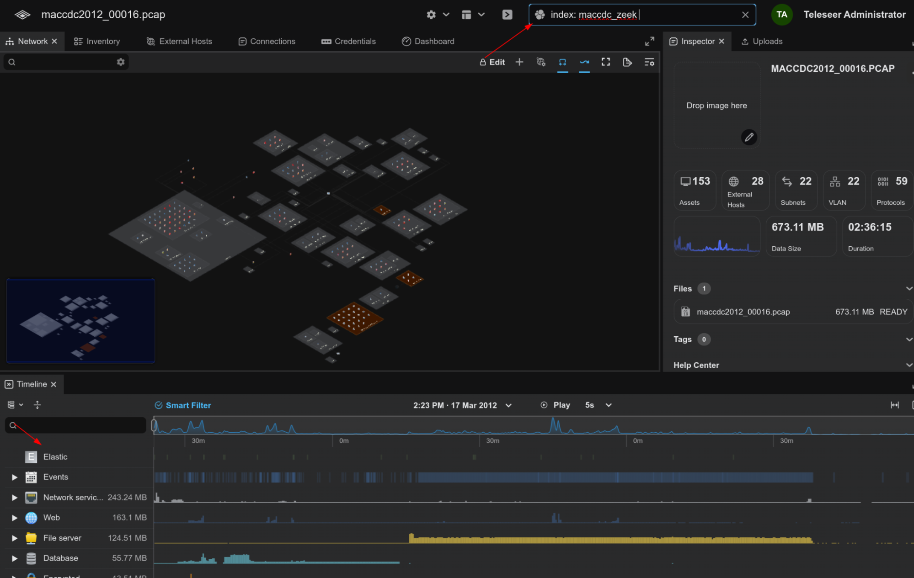

> **Note**:  The Elasticsearch query must begin with the syntax `index: <an_index>` followed by the rest of an (optional) query specified in Lucene syntax.

When the Elasticsearch connector is properly configured (see next section), and the results of the query overlap the time-frame encompassing the Teleseer Project, a Elasticsearch lane will appear at the top of the timeline visualizing when the Elasticsearch events occurred in time. Selecting or hovering over these events will reveal the underlying Elasticsearch event details.  

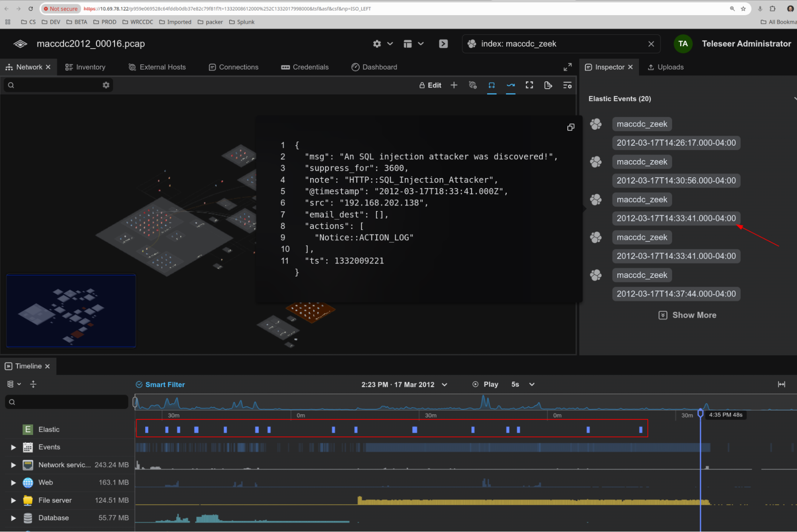

The Elasticsearch lane will contain events that correspond to the result set of the same search executed in Elasticsearch.  For example, in case of the image above, this is the ES query (shown in Kibana):

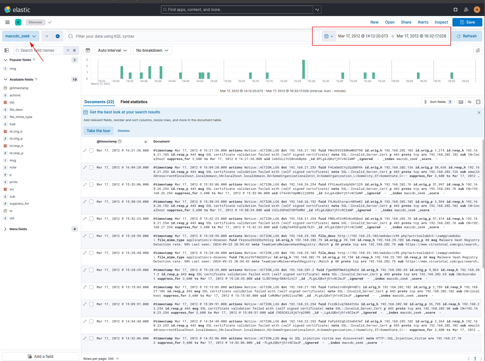

Teleseer will also match any host in its inventory that shares a MAC address or IP address with any event returned from Elasticsearch.  These hosts that have IP addresses or MAC addresses in Elasticsearch events will be specially designated with an `Elastic` tag.

These are searchable, allowing a user to quickly filter for hosts that appear in the Elasticsearch query:

* * *

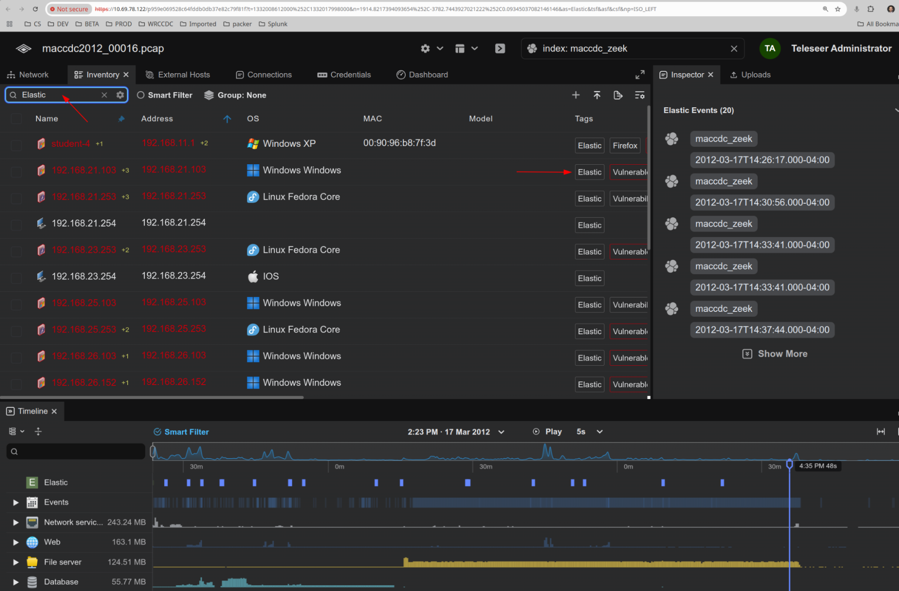

> **Note**: Matching Elasticsearch records to Teleseer hosts by IP and MAC Address is speculative, and may result in false positives matches (or false negatives).  IPs and MAC addresses can dynamically change.  It’s also possible to have two hosts with the same IP on different subnets – both in a single Teleseer project.  Teleseer uses a robust technique for identifying hosts and should be considered ground truth for all host identification.

It is important to reiterate that if the Elasticsearch query does not yield events that overlap in the same time bounds as the project, they will not be displayed.  The time bounds of the Teleseer project are defined as the earliest and latest times that appear in the PCAPs and other telemetry uploaded into the project.  This is depicted in the timeline.  Teleseer does not use any of the Elasticsearch event times to set its own time bounds – they are strictly an additive layer.

## Teleflow Splunk Integration

### Overview

Teleseer includes a Splunk Teleflow Connector that exports Teleflow data from Teleseer projects to Splunk. When properly configured and enabled, the connector will run after every project build/update and stream the Teleflow rows to Splunk. The Splunk Teleflow Connector uses Splunk’s HTTP Event Collector (HEC) for the streaming.

### Visualizing Teleflow in Splunk

You can visualize the Teleflow events in Splunk by searching for this index (e.g. index=teleflow) and ensuring the time overlaps with the Teleseer project time.  When records are returned you can see the project_id of the Teleseer project:

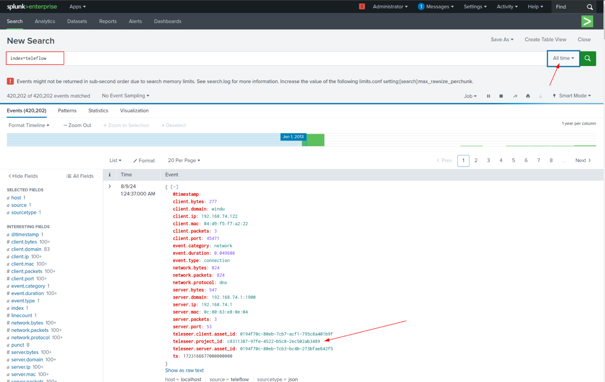

You can further specify the project id, by noting the project id in Teleflow, and using it in the Splunk query:

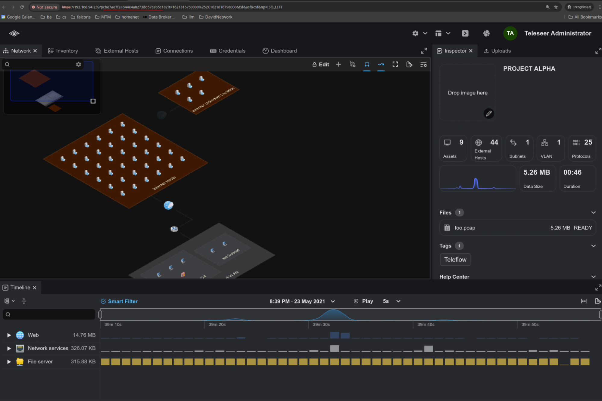

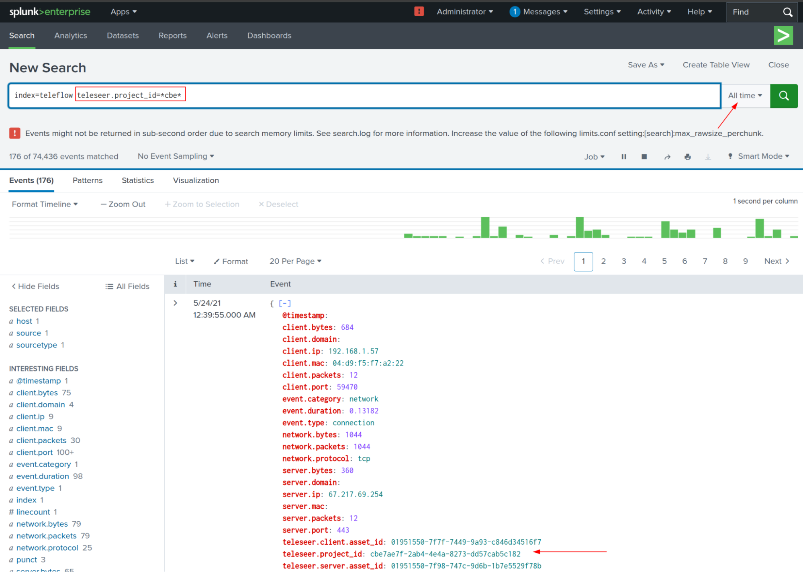

## Teleflow Elasticsearch Integration

### Overview

Teleseer includes an Elasticsearch Connector that exports Teleflow data from Teleseer projects to Elasticsearch.  The connector will run after every project build or update and stream the Teleflow rows to Elasticsearch.  The Elasticsearch connector uses native HTTP APIs.

Teleflow Connector settings are currently administered by Teleseer Field Support Personnel.  Information in the sections below will guide you in gathering required details for the connector configuration and checking the connector operation after each project update.  

### Visualizing Teleflow in Elasticsearch

#### Index Management

Elasticsearch will automatically place teleflow records in the index provided in the connector settings json (e.g. teleflow).  This can be viewed in Kibana or queried with the Elasticsearch API.  Index templates for Teleflow (to support Logstash, etc) are available by contacting Teleseer support.  See the [Contact Support](#h.y7saj6tn3cjf) section at the end of this document.

#### Kabana Discover

To view the teleflow index in Kibana, you will need to establish an Index Pattern targeting the teleflow index.  

1. Select the left hand sandwich menu, then Stack Management under Management:

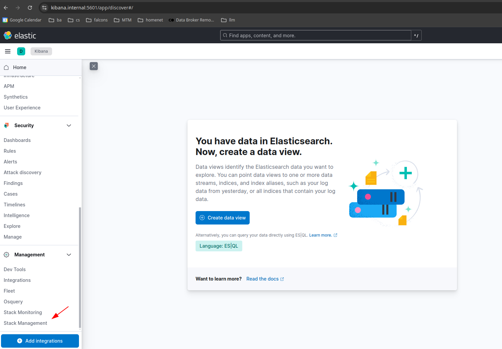

2. Next, select Data Views:

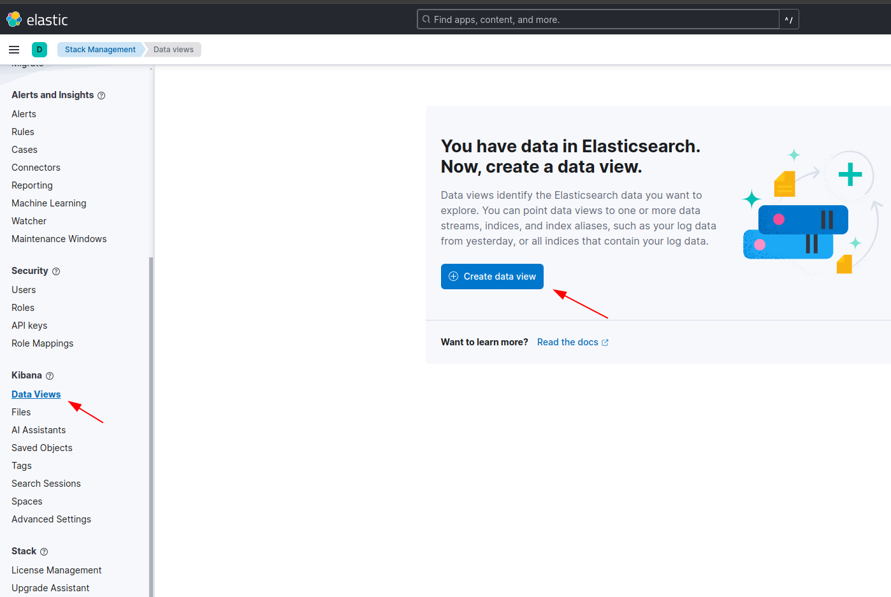

3. Create a new Data View named teleflow (or any name of your choosing), with the index pattern set to teleflow* and the timestamp field set to @timestamp:

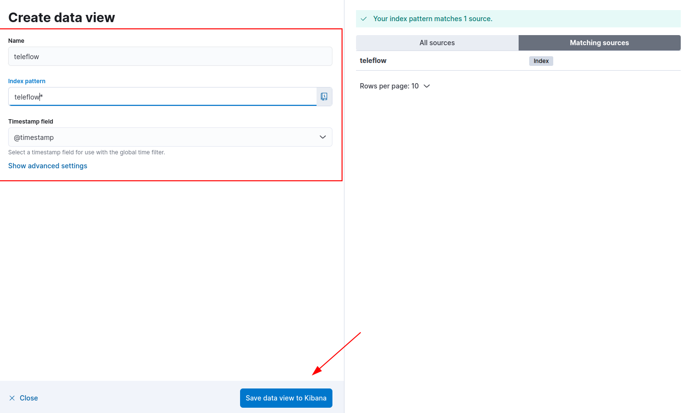

4. This will generate a Teleflow Data Views entry:

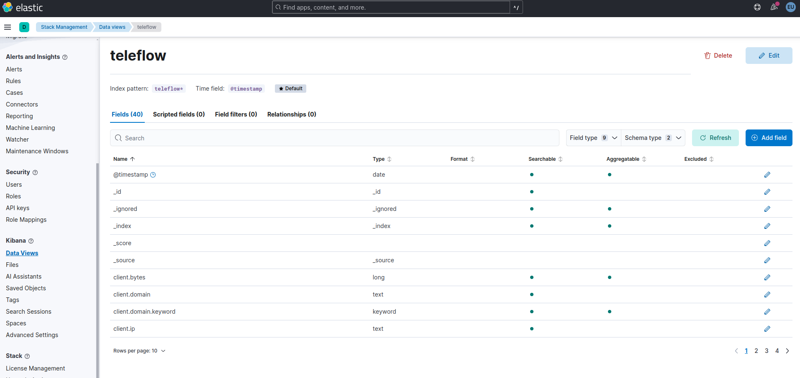

* * *

You can interact with the new Data View using `Kibana > Analytics > Discover`:

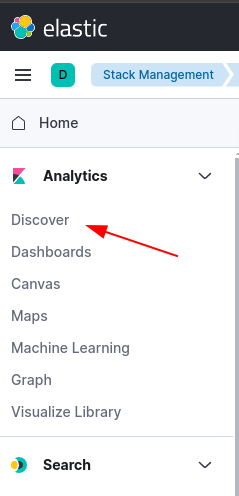

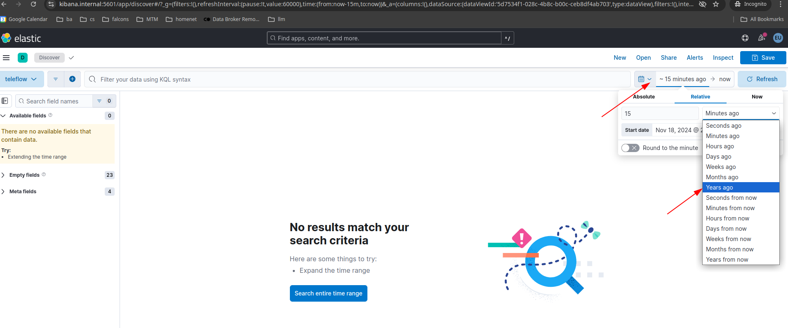

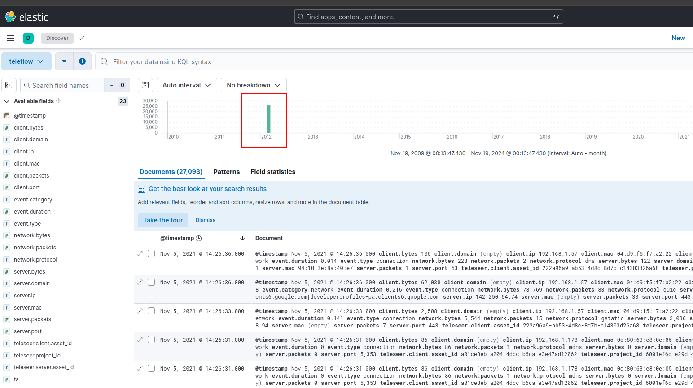

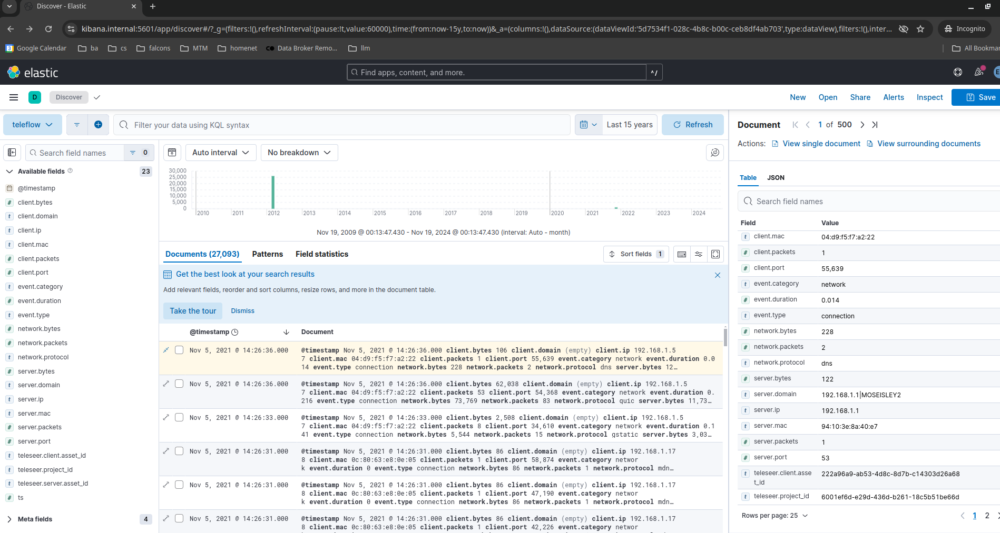

#### Teleflow Kibana Dashboards

The teleflow dataset is ideally suited for building Kibana visualizations and dashboards, as it adheres to the Elastic Common Schema (ECS), which standardizes the representation of various data fields. This provides a consistent framework that enhances the interoperability and usability of the data. The dataset contains detailed fields such as timestamps, client and server MAC addresses, IP addresses, ports, and event durations, all of which are mapped to ECS-compliant fields.  For example, a Time Series Line Chart can be utilized to visualize the number of DHCP requests over time, allowing users to identify peak usage periods. A Data Table can summarize interactions, displaying top clients by bytes transferred or packets sent, which aids in analyzing network performance. A Pie Chart can show the distribution of network protocols.  By leveraging the ECS framework, these visualizations facilitate efficient monitoring, analysis, and troubleshooting of network behavior.  An example dashboard is shown below:

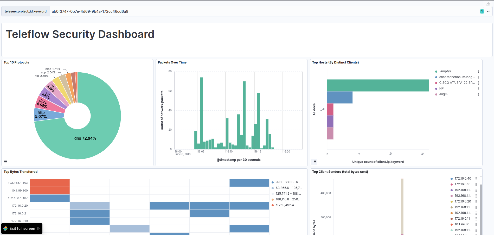

When working with the "teleflow" dataset mapped to the Elastic Common Schema (ECS), there are several pitfalls and considerations to keep in mind to ensure effective analysis and visualization:

- Data Completeness: ensure that all relevant fields are populated consistently.  Missing data can lead to misleading visualizations and interpretations.
- Time Zone Handling:  be mindful of time zone differences when analyzing timestamps.  Data may originate from various time zones, affecting time-based visualizations if not standardized.
- Data Volume:  large volumes of data can impact performance and visualization load times. Implement appropriate filtering or aggregation to enhance responsiveness.
- Security and Privacy:  consider the sensitivity of the data, particularly MAC and IP addresses. Ensure compliance with data protection regulations and practices to safeguard user privacy.
- Anomaly Detection:  be cautious when interpreting outliers or anomalies in the data; they may indicate either legitimate issues or data inaccuracies. Contextual analysis is crucial.
- Project Management:  the "teleflow" index contains data from multiple projects, which must be accounted for in visualizations. Implementing effective filtering mechanisms is essential to isolate and analyze data specific to each project, ensuring clarity and relevance in the insights generated.

