# Splunk Integration Guidance (T05)

## Splunk Configuration

### Splunk Query Connector Configuration

To enable the connector visit the Workspace Settings as an administrator.   The Splunk connector settings appear on the main settings page.   You will need an active Splunk instance that is reachable from the Telesser instance in order to proceed.

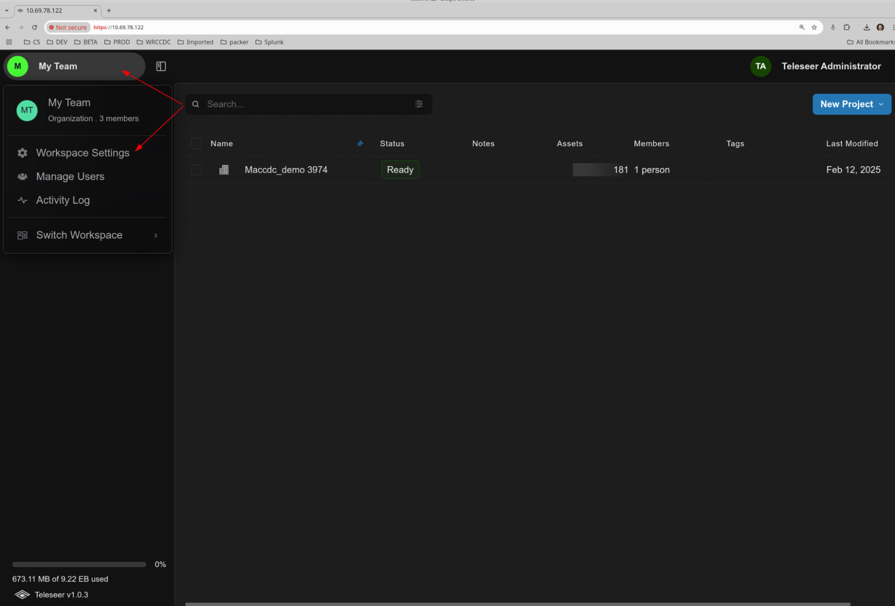

* * *

The Splunk workspace settings subpanel covers connector settings for incoming data and connector settings for outgoing data.  The outgoing connector, known as Teleflow, is described in subsequent sections.

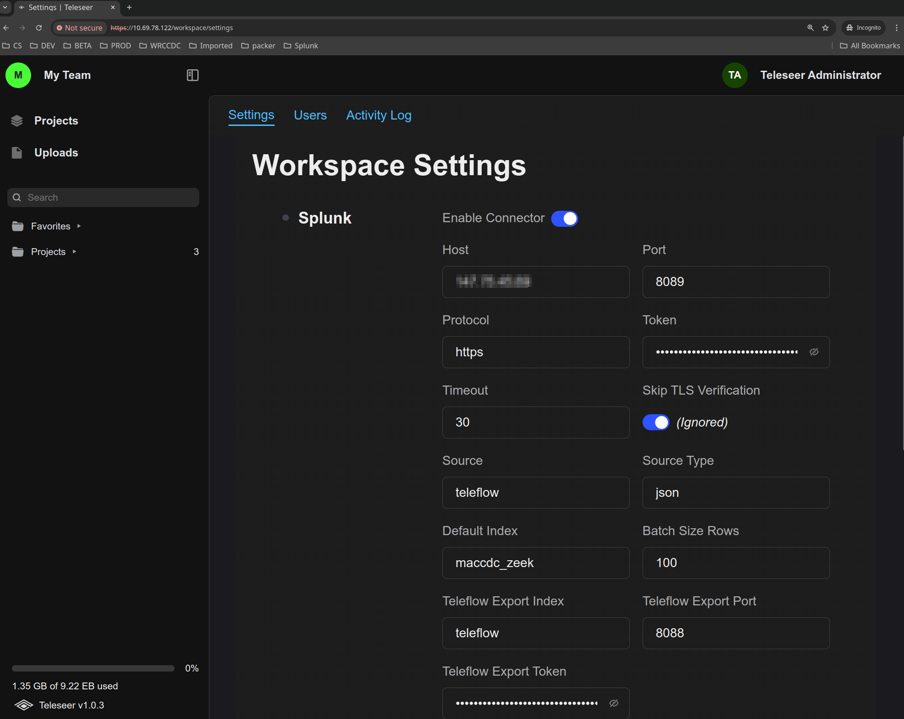

The Splunk Connector subpanel contains the following settings for configuring the Splunk Query Connector.  Contact your Splunk Administrator for clarification of any setting:

- Host: the hostname or IP address of the Splunk server.
- Port: the port hosting the Splunk API on the Splunk server.  This is usually 8089.
- Protocol: the protocol (http/https) used to connect to the Splunk service.  Normally https.
- Token: Splunk API token with access to searched index.  Provided by Splunk Admin.
- Timeout: the connection timeout (in seconds) used when connecting to the Splunk instance.
- Ignore Self-Signed Certificate: if enabled, TLS certificate errors are ignored.
- The following fields are for the outbound Splunk Teleflow connector (described below):  Teleflow Export Port, Source, SourceType, BatchSizeRows, Teleflow Export Token, Teleflow Export Index.

##### Splunk API Configuration

As shown above, the Teleseer Splunk Query Connector requires a Splunk API Token.  These are configured by a Splunk Administrator.  On their Splunk cluster, the Admin can visit Settings, Tokens:

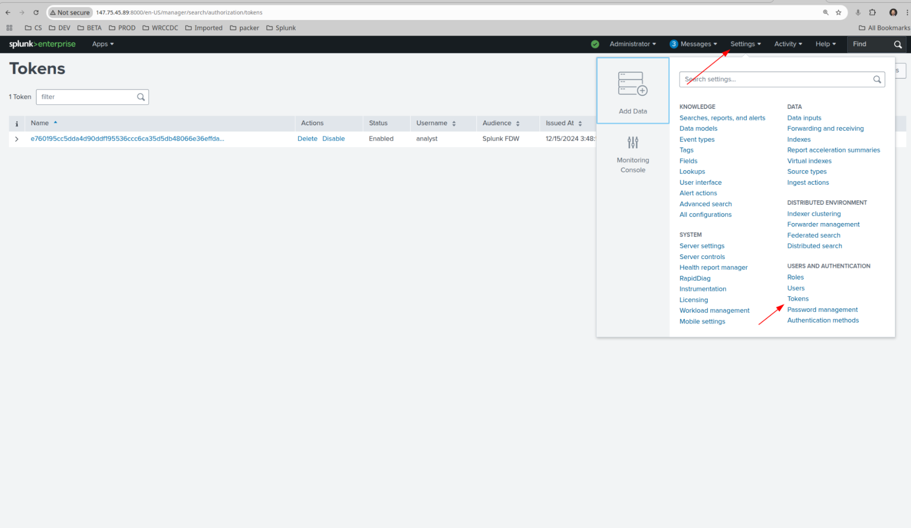

Select the `New Token` button, and fill out the form.  The Administrator must associate the token to an active user on Splunk:

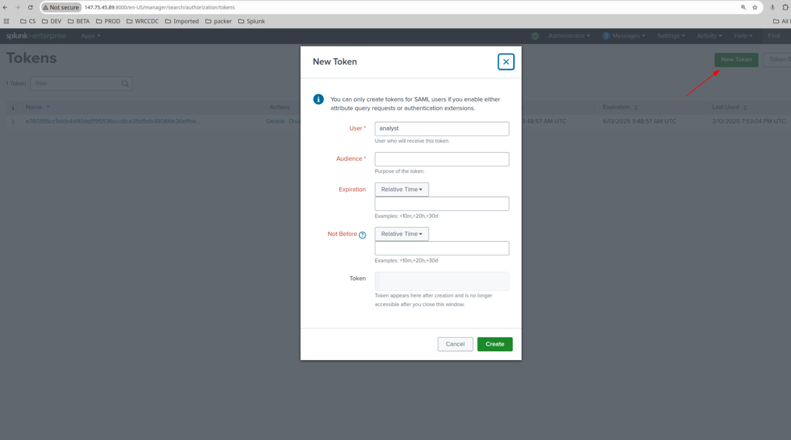

After filling out the details, the API key will appear and must be copied and saved before closing the form!

The Splunk administrator should also check which indices in Splunk that account tied to the token can access.  Visit `System Settings > Roles` and verify the user/role access for the index(ies):

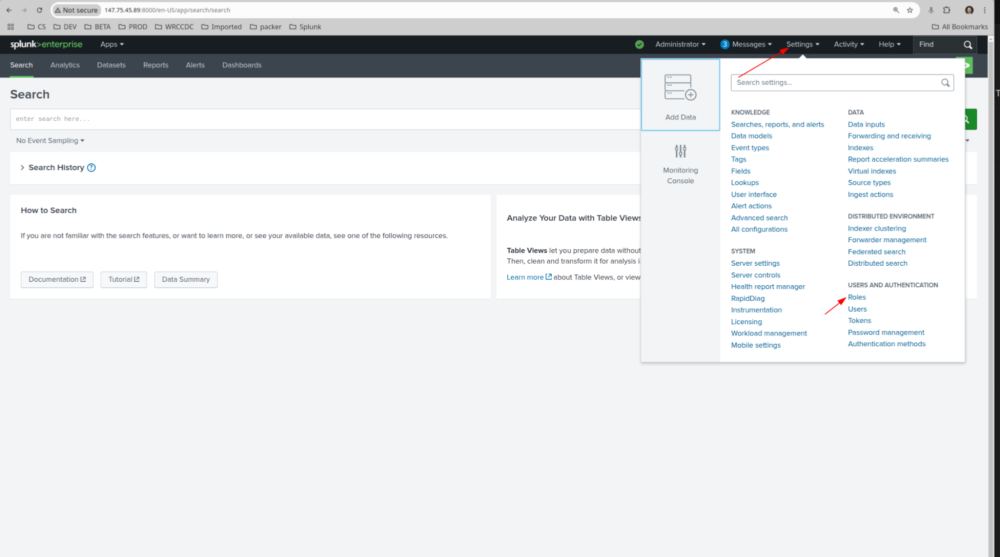

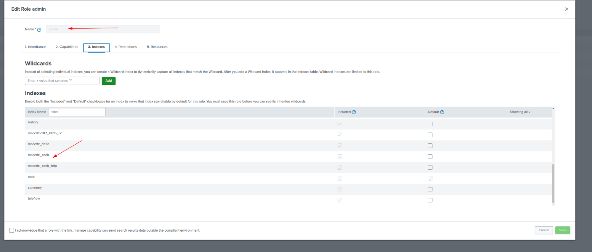

#### Troubleshooting

Please see the Troubleshooting section for Common Splunk Connector issues and solutions.

### Splunk Teleflow Connector Configuration

The Splunk Teleflow Connector settings are available in the `Workspace Settings` panel of Teleseer:

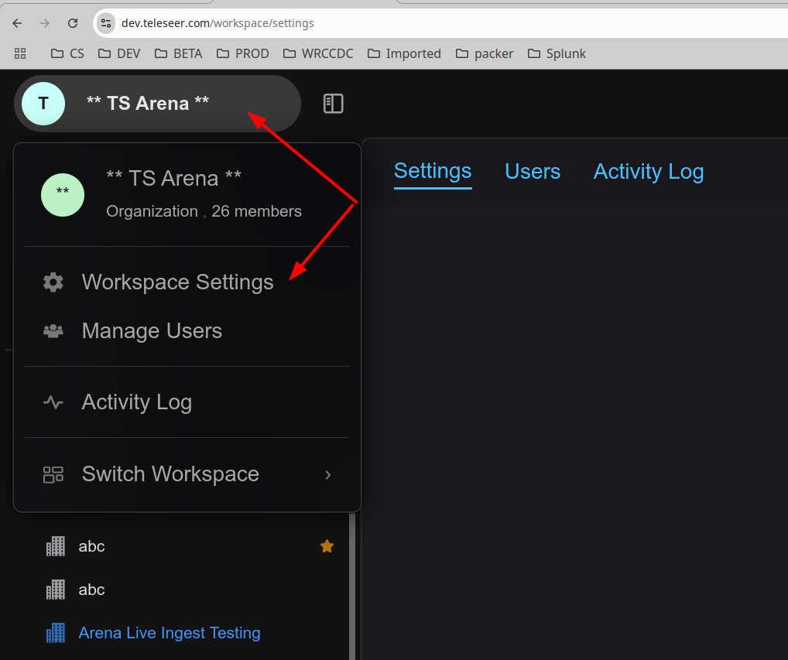

The workspace settings will display options for Splunk integration.  The Splunk configuration area has settings for inbound (SID search) and outbound (Teleflow) configuration.  The following instructions pertain to the outbound Teleflow configuration settings which do not include the settings described in the [Querying Splunk](#h.ro78e0k3im4h) section above for the incoming data connector.  You need to be logged in as an administrator to change any of the settings for Splunk.

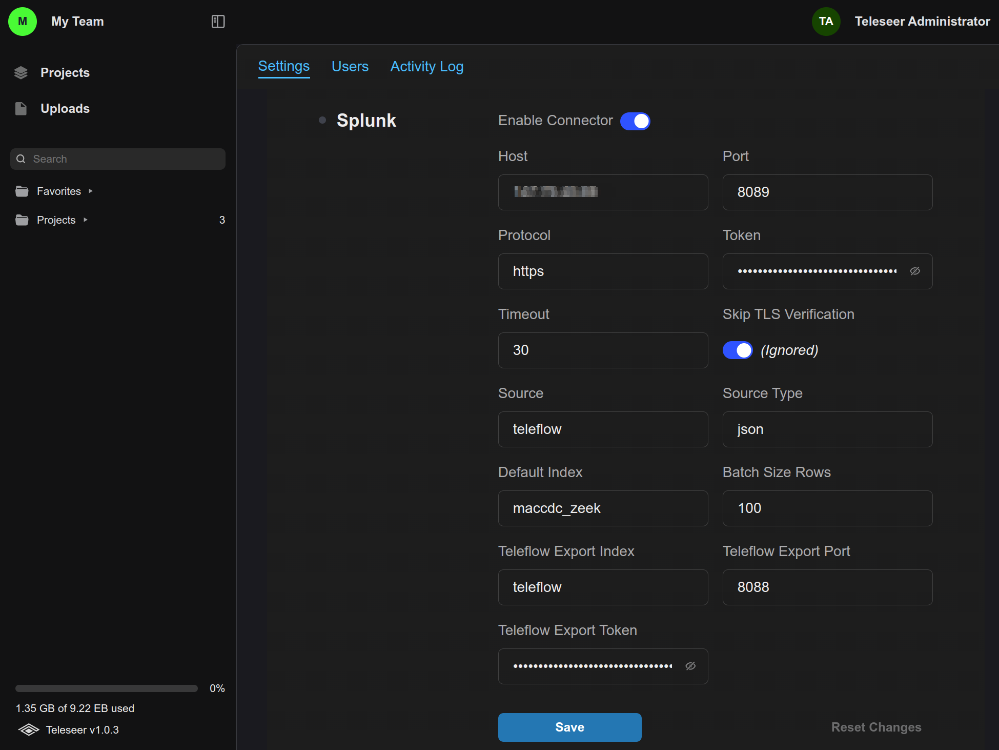

The Splunk Connector subpanel contains the following settings for configuring the Splunk Teleflow Connector.  Contact your Splunk Administrator for clarification of any setting:

- Host: the hostname or IP address of the Splunk server.
- Teleflow Export Port: the port hosting the Splunk API on the Splunk server.  This is usually 8089.
- Protocol:  the protocol (http/https) used to connect to the Splunk service.  Normally https.
- Teleseer Export Token:  Splunk HTTP Event Collector (HEC) API token.  Provided by Splunk Admin.  This is not the same token as the Splunk API Token.
- Timeout: the connection timeout (in seconds) used when connecting to the Splunk instance.
- Skip TLS Verification:  if enabled, TLS certificate errors are ignored.
- Source:  the source to assign to each exported teleflow event (e.g. teleflow).
- Teleflow Export Index:  the Splunk index to receive the data.  Must be set up in Splunk (See below).
- SourceType:  the source format to assign to each teleflow (must be set to json).
- BatchSizeRows:  the number of rows to send in each Splunk HEC batch and will determine how long it takes to ship all the teleflow to Splunk.  Also depends on Splunk Server configuration.   100-2000 are typical good values.

 > Note: The following field is for the incoming Splunk Query connector (described above):  *Token*

#### Splunk HEC Configuration

The Splunk connector requires three things in Splunk:

- A configured Splunk Index
- Splunk HEC Collector Token
- A configured Splunk Source Type

#### Creating a Splunk Teleflow Index

1.  in Splunk, visit `Settings > Indexes`:

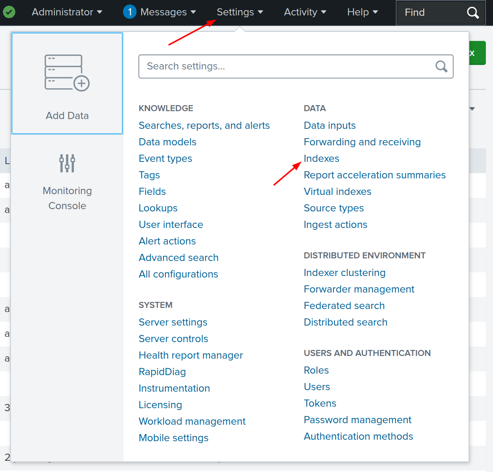

Accept the defaults.

#### Creating a Teleflow Source Type

You will need to configure a Splunk Source Type to properly parse the data coming from Teleseer.

1. In Splunk, visit `Settings > Source types`:

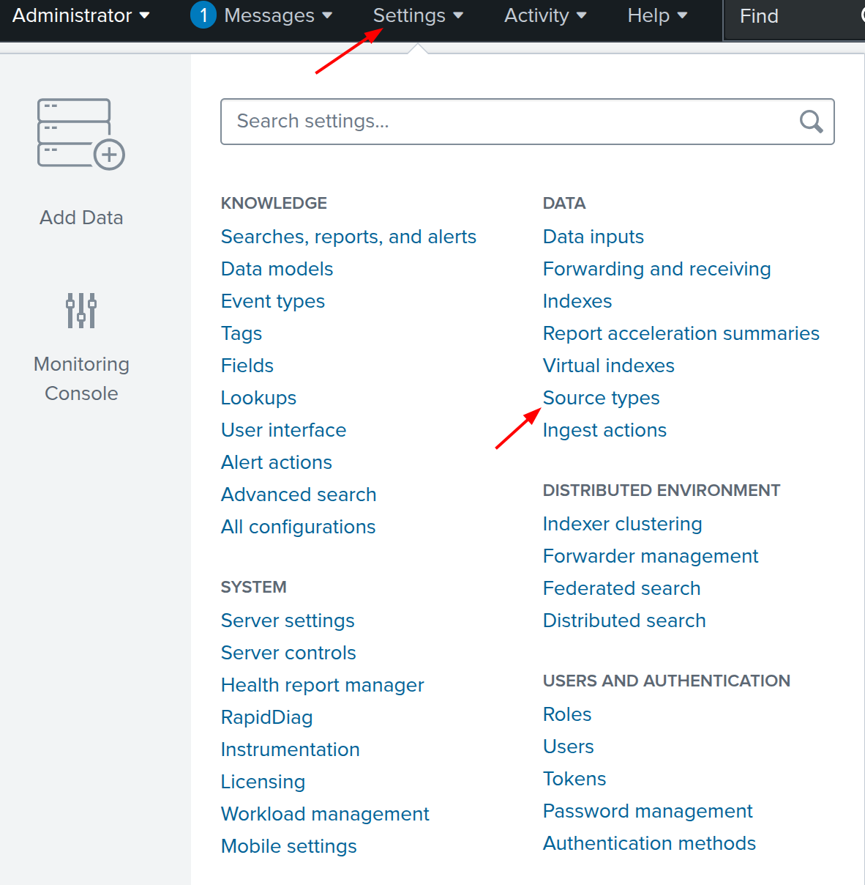

2. Select `New Source Type`:

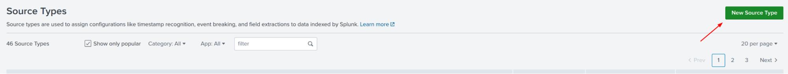

3. Create a new json source type, adding a Name and Description for teleflow:

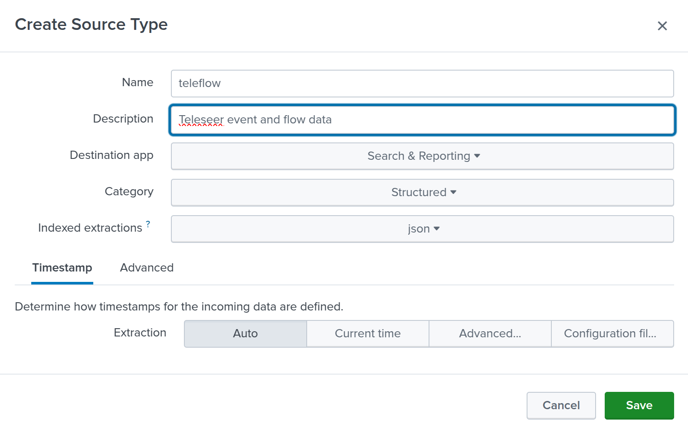

4. Save the new source type.  It should now appear in the Source Types list (hint: use filter).

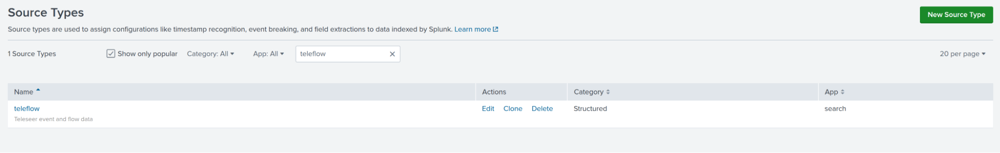

### Creating a Splunk HEC Connector Token

You will need a Splunk HTTP Event Collector token (with enabled Splunk HEC Endpoint) to send data to Splunk.  To create a token, a Splunk admin user should first login to Splunk.  
1. Once logged in, visit Settings, then Data Inputs:

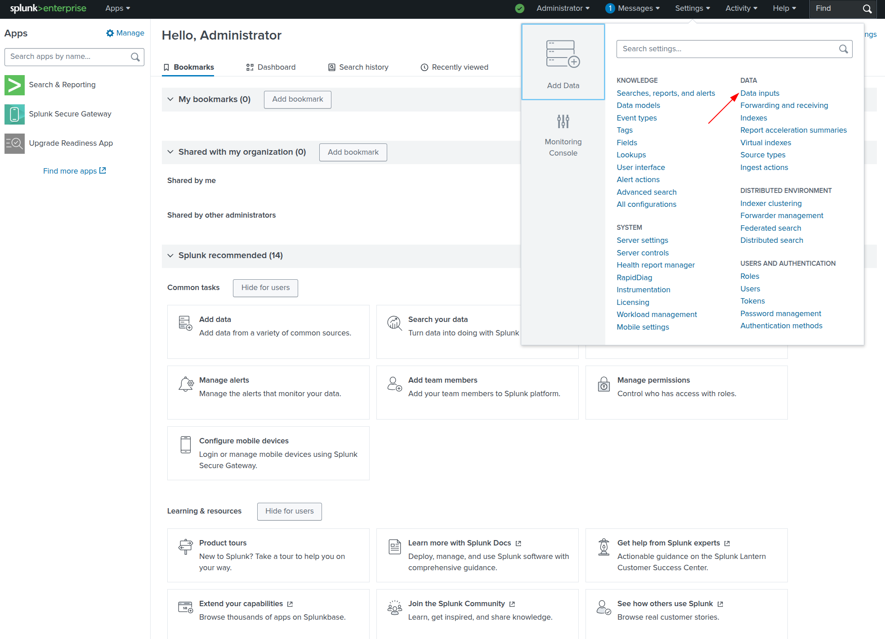

2. Select HTTP Event Collector and then New Token.

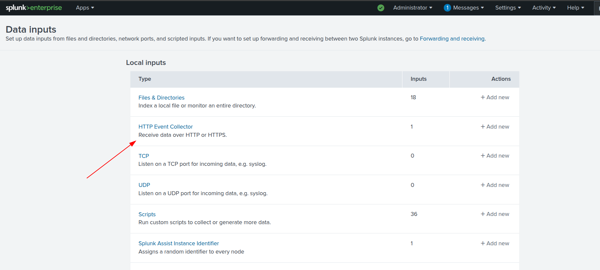

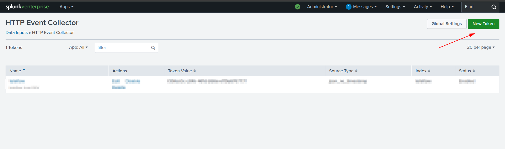

3. Enter information about the teleflow data expected to use the endpoint:

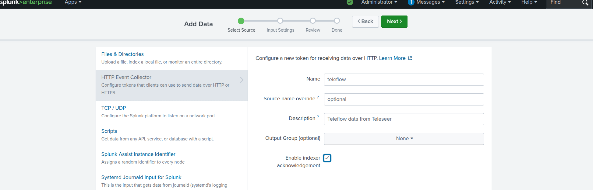

4. Click next and select the teleflow index created earlier:

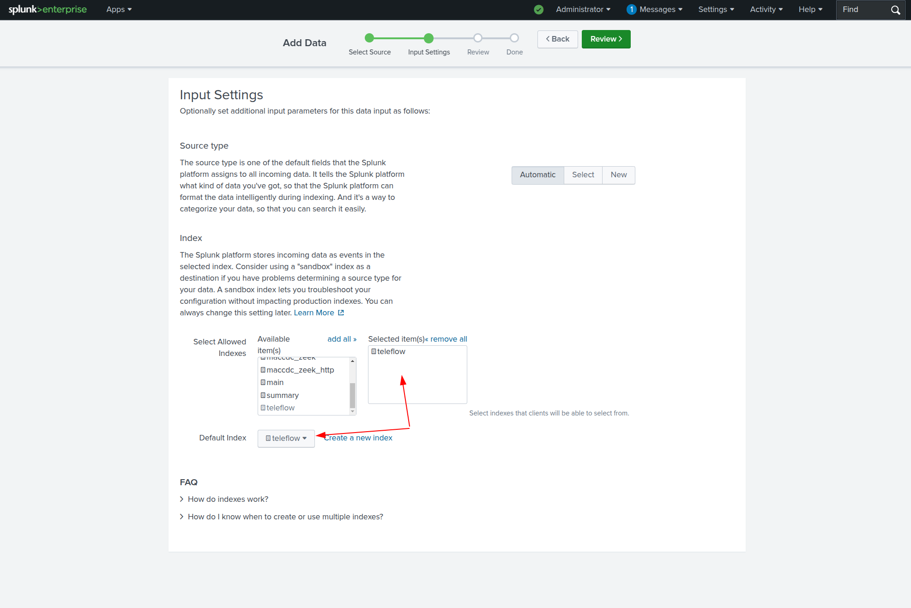

5. Review the settings on the next page, then Click Done/Next.  You will be presented with the Splunk HEC Token value.  Paste this into the Teleseer Splunk settings.

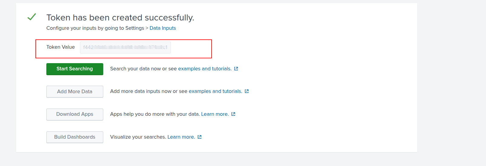

