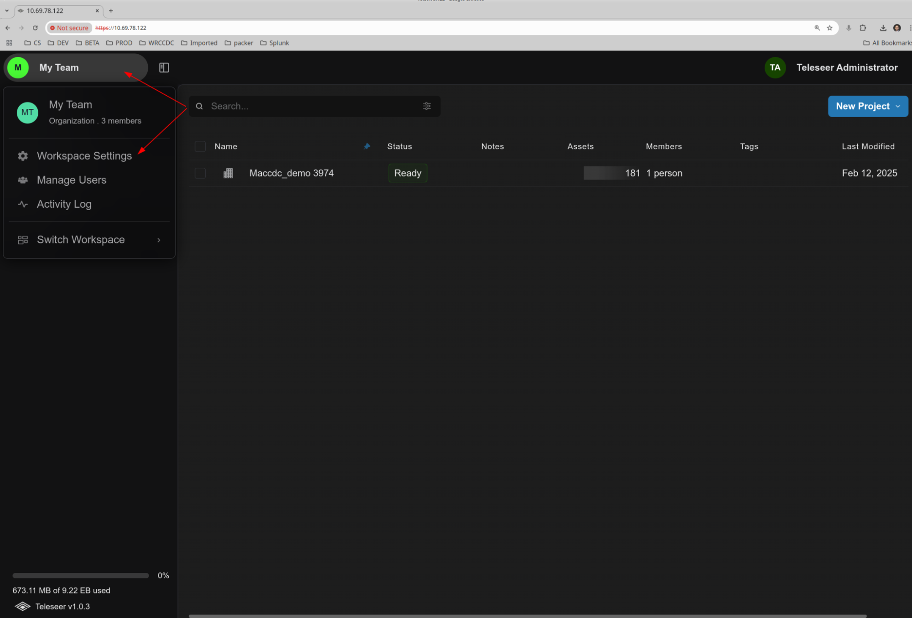
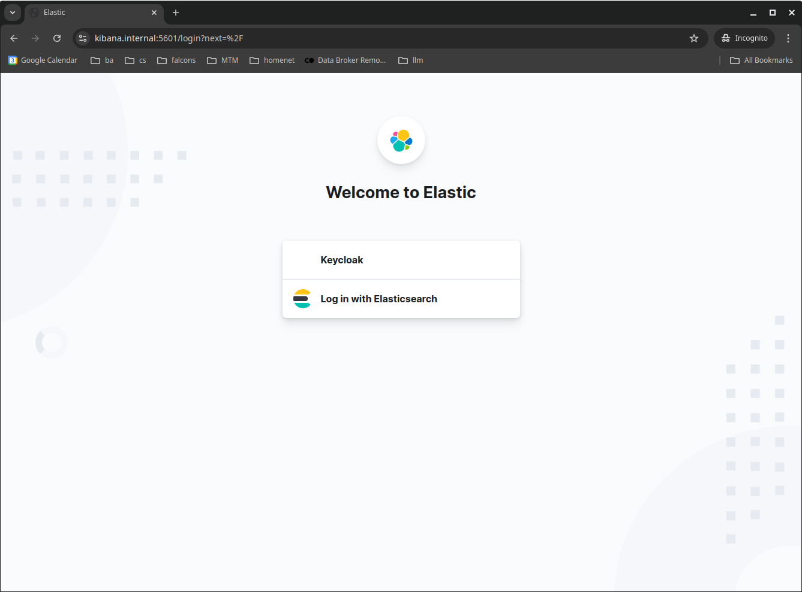

# Elasticsearch Integration Guidance (TO6)


## Elasticsearch Configuration


#### Elasticsearch Query Connector Configuration

To enable the connector, visit the organizational settings  as an administrator.  The Elasticsearch connector settings appear on the main settings page.  You will need an active Elasticsearch instance that is reachable from the Teleseer instance in order to proceed.

* * *



The Elasticsearch workspace settings subpanel covers connector settings for incoming data and connector settings for outgoing data.  The outgoing connector, known as Teleflow, is described in subsequent sections.


The Elasticsearch Connector subpanel contains the following settings for configuring the Elasticsearch Query Connector.  Contact your Elasticsearch Administrator for clarification of any setting:

- Host: the `hostname` or IP address of the Elasticsearch server.
- Port: the port hosting the Splunk API on the Elasticsearch server.  This is usually 9200.
- Protocol:  the protocol (`http/https`) used to connect to the Elasticsearch service.  Normally `https`.
- Token:  Elasticsearch API token with access to searched index.  Provided by ES Admin.
- Timeout: the connection timeout (in seconds) used when connecting to the ES instance.
- Ignore Self-Signed Certificate:  if enabled, TLS certificate errors are ignored.
- Default Index:  the default index to search from Teleseer.  This must be an index, not a view.
- The following fields are for outbound connector (described) below:  Teleflow Export Index, Batch Size Bytes.

##### Elasticsearch API Configuration

Teleseer will need an Elasticsearch API token to access data in Elasticsearch.  An Elasticsearch user with admin or power user roles can get a key via Kibana.  First, an Elasticsearch admin or power user should login to Elasticsearch:



If Kibana and Elasticsearch are configured to authenticate via Keycloak, you may be routed through your organization's Keycloak login portal:


Once logged in, visit the left hand menu and then Dev Tools:


Enter the following into the lefthand subwindow, replacing any thing that is already there:

```
POST /_security/api_key
{
  "name": "teleseer-api-key",
  "expiration": "364d"
}
```


Then press the play button.  The api key will be presented in the right hand sub-window.  You will need to note the encoded field which represents the Elasticsearch API key Teleseer will use to send data:


**TLS/SSL Connectivity**

When connecting Teleseer to a TLS-enabled Elasticsearch (ES) instance, you may need to supply the Teleseer Connector with the Elasticsearch API Certificate Authority certificate.  If the Elasticsearch API Certificate Authority certificate is well-known (e.g. DigiCert, Let’s Encrypt), it may already be recognized by the Teleseer server’s trusted certificate list.  However, if the CA is part of a self-signed or local set-up, then you will need to supply the CA certificate.  This is a path specified in the “cacert_path” field of the connector json obj:

```
{
.
.
"cacert_path": "/srv/teleseer/http_ca.crt",
.
.
}
```

This is the full path on the Teleseer server, desktop, or VM where you have placed a copy of the Elasticsearch CA certificate.  You will need to locate the certificate authority certificate on your ES Instance, secure copy (scp) it to the Teleseer server, and then place it in a readable folder.  The folder `/srv/teleseer` is a good candidate location. Copy the CA certificate file from Elasticsearch to this folder and ensure the file has 0644 file permissions.

The Elasticsearch CA certificate is usually found in the certs subfolder of the Elasticsearch configuration directory (e..g `/etc/elasticsearch/certs`), named `ca.crt` or `http_ca.crt`.  

You can use the ES `_ssl/certificates` endpoint (via Kibana) to query for certificate metadata:


### Elasticsearch Teleflow Connector Configuration

The Elasticseach Teleflow Connector settings are available in the `Workspace Settings` panel of Teleseer:


The Workspace settings will display options for Elasticsearch integration.  The Elasticsearch configuration area has settings for inbound (SID search) and outbound (Teleflow) configuration.  The following instructions pertain to the outbound Teleflow configuration settings, which do not include the settings described in the Querying Elasticsearch section above for the incoming data connector.  You need to be logged in as an administrator to change any of the settings for Elasticsearch.


The Elasticsearch Connector subpanel contains the following settings for configuring the Elasticsearch Teleflow Connector.  Contact your Elasticsearch Administrator for clarification of any setting:

- Host: the hostname or IP address of the Elasticsearch server.
- Teleflow Export Port: the port hosting the Elasticsearch server.  This is usually `9200`.
- Protocol:  the protocol (`http/https`) used to connect to the Elasticsearch service.  Normally `https`.
- Token:  Elasticsearch API token.  Provided by Elasticsearch Admin.
- Timeout: the connection timeout (in seconds) used when connecting to the Elasticsearch instance.
- Skip TLS Verification:  if enabled, TLS certificate errors are ignored.
- Teleflow Export Index:  the Elasticsearch index to receive the data.  If not setup in advance, this will be created when events flow into Elasticsearch.
- BatchSizeRows:  the number of bytes to send in each Elasticsearch POST batch and will determine how long it takes to ship all the teleflow to Elasticsearch.  Also depends on Elasticsearch server configuration.   500000-100000 bytes are typical good values.

 > Note: The following field is for the incoming Elasticsearch Query connector (described above):  *Token*

